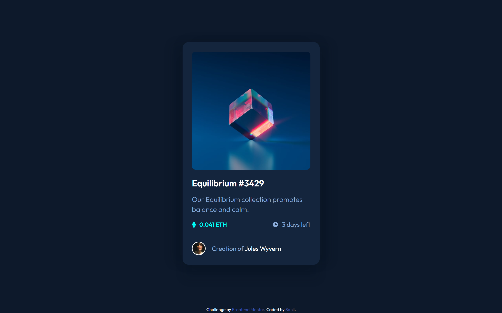
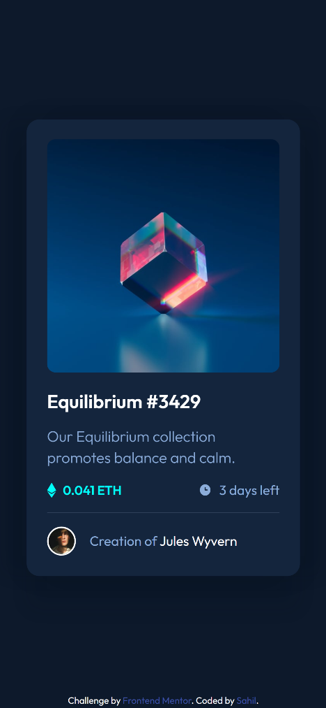

# Frontend Mentor - NFT preview card component solution

This is a solution to the [NFT preview card component challenge on Frontend Mentor](https://www.frontendmentor.io/challenges/nft-preview-card-component-SbdUL_w0U). Frontend Mentor challenges help you improve your coding skills by building realistic projects. 

## Table of contents

- [Overview](#overview)
  - [The challenge](#the-challenge)
  - [Screenshot](#screenshot)
  - [Links](#links)
- [My process](#my-process)
  - [Built with](#built-with)
  - [What I learned](#what-i-learned)
- [Author](#author)


## Overview

### The challenge

Users should be able to:

- View the optimal layout depending on their device's screen size
- See hover states for interactive elements

### Screenshot





### Links

- Solution URL: [sahil-randhawa.github.io/NFT-preview-card/](https://sahil-randhawa.github.io/NFT-preview-card/)
## My process

### Built with

- Semantic HTML5 markup
- CSS custom properties
- Flexbox
- Mobile-first workflow


### What I learned

Good practise for responsive layout, image overlay and hover animations.

```css
    .overlay {
      position: absolute;
      top: 0;
      left: 0;
      bottom: 0;
      right: 0;
      height: 100%;
      width: 100%;
      opacity: 0;
      transition: 0.25s;
      background: hsl(178, 100%, 50%, 0.5);
      border-radius: 10px;
    }
    .image-container:hover .overlay {
      opacity: 1;
      cursor: pointer;
      ;
    }
```


## Author

- Website - [Sahil](https://www.artoonal.com)
- Frontend Mentor - [@sahil905](https://www.frontendmentor.io/profile/sahil905)


